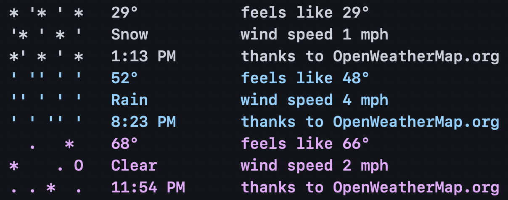

# Ascii-Weather


A simple, ascii-based weather visualizer for the terminal.
The ascii-art updates to match the current weather and conditions.
Uses ipinfo.io and openweathermap.org for your location and weather data, respectively.

Some examples:



### Set-up:

1. Fork this repo.
2. Install packages using  `pip install -r requirements.txt`
3. Test that it works on your machine. To run anywhere from your shell,
Create a .aliases in your home directory, then add:
```sh
#!/usr/bin/env bash

alias weather="python3 /path/to/ascii-weather/main.py"
```

NOTE: You'll need an API key from OpenWeatherMap.org, and to create your own
credentials.py.

### To-do:
- [ ] Add a more elegant way to detect user’s current time/time zone, rather than a set nighttime period
- [ ] Write unit tests to check for all possible combinations of API data
- [ ] Add an alternative to ipinfo.io
